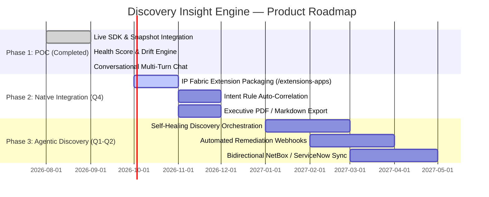

# 📄 Product Requirements Document (PRD)

# Network Discovery Insight Engine

| Metadata | Details |
|---|---|
| **Product Area** | Network Discovery & Platform Foundations |
| **Document Author** | **Ranaji Deb** (Senior Product Manager & UX Leader) |
| **Target Platform** | IP Fabric v8.x / Extension Ecosystem |
| **Status** | Working POC Completed ➔ Proposed Product Capability |
| **Classification** | Product Strategy & Technical Specification |

---

## 1. Executive Summary & Problem Context

### 1.1 The Strategic Problem
IP Fabric is built on a single promise: **uncovering the truth about complex enterprise networks**. 

Network Discovery is where that trust is won or lost. Every snapshot collects millions of data points across multi-vendor routing tables, switching fabrics, cloud VNets, and security policies. However, today’s enterprise customers face three fundamental friction points when interacting with raw discovery data:

1. **Discovery Blindspot Anxiety:** Network teams cannot easily tell if a discovery ran with 100% fidelity or if credentials failed on 15 critical edge switches, leaving blind spots.
2. **Drift Triage Overload:** Between snapshots (e.g., weekly or post-change window), thousands of attributes change. NetOps teams lack automated, product-framed synthesis to understand *which changes represent intent violations versus normal operational noise*.
3. **The Data-to-Decision Gap (AIOps):** While IP Fabric collects immaculate data and exposes a built-in MCP server, non-CLI stakeholders (CISOs, Infrastructure VPs, Cloud Architects) still need high-level, business-framed answers to complex architectural questions.

### 1.2 The Proposed Solution: Discovery Insight Engine
The **Discovery Insight Engine** is an intelligent decision-support layer built on top of IP Fabric's Python SDK and digital twin model. It transforms raw technology tables into:
- An instant **Discovery Health Scorecard** highlighting coverage gaps and failure hotspots.
- An automated **Snapshot Drift Detector** that evaluates network mutations against intended design.
- An interactive **Multi-turn Network Reasoning Agent** that answers strategic questions with concrete Insight Engine recommendations.

---

## 2. Product Conceptualization Journey

```
┌─────────────────────────────────────────────────────────────────────────────┐
│                       EVOLUTION OF THE PRODUCT CONCEPT                      │
│                                                                             │
│  [Step 1: Initial Idea]                                                     │
│  External Vendor Prioritisation Tool based on scraped public data           │
│  (G2 reviews, public forums, market share analysis)                         │
│                                                                             │
│                                    ▼                                        │
│                                                                             │
│  [Step 2: Grounded Realization & Domain Pivot]                              │
│  Customer value lies in their *own* network truth. Shifted to               │
│  ingesting live snapshot data via IP Fabric's official SDK (python-ipfabric) │
│                                                                             │
│                                    ▼                                        │
│                                                                             │
│  [Step 3: MCP & AI Alignment]                                               │
│  Rather than duplicating IP Fabric's built-in MCP tool layer, built the      │
│  "Product Framing" layer that translates raw tool outputs into customer ROI  │
│                                                                             │
│                                    ▼                                        │
│                                                                             │
│  [Step 4: Working Prototype & Extension Roadmap]                            │
│  Shipped a dual-mode Streamlit POC running against a live GCP IP Fabric VM,  │
│  designed to drop into IP Fabric's native Extension runtime (/extensions-apps)│
└─────────────────────────────────────────────────────────────────────────────┘
```

---

## 3. Target User Personas & Problem Scenarios

| Persona | Primary Goal | Current Pain Point | How Discovery Insight Engine Solves It |
|---|---|---|---|
| **Principal Network Architect** | Ensure multi-vendor topology integrity & cloud transition | Cannot easily assess vendor concentration risk or unmanaged cloud assets | Generates vendor diversity breakdowns and flags unassigned sites/cloud VNets |
| **Lead NetOps / SRE Engineer** | Validate maintenance windows and detect drift | Manually cross-referencing technology tables after config changes | One-click snapshot diff with root-cause evaluation and intent validation |
| **VP of Infrastructure / CISO** | Ensure compliance & audit readiness across hybrid estate | Raw network tables are too low-level; reports take weeks to compile | Executive summary + prioritised risk findings generated in seconds |

---

## 4. Functional Requirements (P0 / P1 / P2)

### 4.1 Discovery Health & Coverage Assessment (Tab 1)

| Priority | Feature ID | Requirement Description | Acceptance Criteria |
|---|---|---|---|
| **P0** | `FR-DH-01` | **Live Inventory Ingestion** | Ingest device inventory, sites, vendors, and task statuses via `ipfabric.inventory.devices` |
| **P0** | `FR-DH-02` | **Visual Health Scorecard** | Render KPIs (Discovered Devices, Vendor Count, Site Count, Failed Tasks) + Interactive Plotly charts |
| **P0** | `FR-DH-03` | **AI Health Synthesis** | Generate structured assessment: Headline score, Top 3 findings with customer impact, Insight Engine recommendation, and Executive Summary |
| **P1** | `FR-DH-04` | **Assessment Caching & History** | Cache generated assessments in session state; provide expandable history of past runs with timestamps |
| **P2** | `FR-DH-05` | **Exportable Executive PDF** | Export the health scorecard and AI recommendations as a branded PDF report |

---

### 4.2 Snapshot Drift & Mutation Detector (Tab 2)

| Priority | Feature ID | Requirement Description | Acceptance Criteria |
|---|---|---|---|
| **P0** | `FR-SD-01` | **Dual Snapshot Selector** | Allow selecting Baseline (Snapshot A) and Current (Snapshot B) from live snapshot catalog |
| **P0** | `FR-SD-02` | **Deterministic Device Diffing** | Identify added devices, removed devices, and attribute modifications (site, OS version, platform) |
| **P0** | `FR-SD-03` | **AI Drift Interpretation** | Provide risk-weighted analysis of network changes, intent deviations, and a "Discovery Quality Verdict" |
| **P1** | `FR-SD-04` | **Drift History Log** | Store sequential snapshot comparisons in session history across tab switches |
| **P2** | `FR-SD-05` | **Technology-Specific Drift** | Extend diffing to BGP neighbor states, interface MTU mismatches, and FHRP priority changes |

---

### 4.3 Interactive Network Reasoning & AIOps (Tab 3)

| Priority | Feature ID | Requirement Description | Acceptance Criteria |
|---|---|---|---|
| **P0** | `FR-NL-01` | **Conversational Interface** | Multi-turn chat interface with user and assistant message streaming |
| **P0** | `FR-NL-02` | **Multi-Turn Follow-Up Support** | Retain full conversation history in payload so users can drill down into previous answers |
| **P0** | `FR-NL-03` | **Product-Framed System Prompt** | Responses must prioritize customer business risk, vendor diversification, and actionable remediation |
| **P1** | `FR-NL-04` | **Quick-Prompt Starter Cards** | One-click suggestion buttons for high-value queries (Vendor Risk, Site Blindspots, Drift) |
| **P1** | `FR-NL-05` | **Session Reset** | "Clear Chat" button to wipe session history and re-initialize context |

---

### 4.4 Data Layer & Operational Resiliency

| Priority | Feature ID | Requirement Description | Acceptance Criteria |
|---|---|---|---|
| **P0** | `FR-DL-01` | **Dual Data Mode Architecture** | Seamless fallback: `DATA_MODE=live` (SDK) or `DATA_MODE=demo` (offline bundled JSON) |
| **P0** | `FR-DL-02` | **Live Snapshot Sync** | "🔄 Sync Live Snapshots" trigger to clear client cache and re-query newly completed discovery tasks |
| **P1** | `FR-DL-03` | **Resilient Connection Timeout** | Fast timeout with graceful error handling if the IP Fabric VM host becomes unreachable |

---

## 5. System Architecture & Integration Blueprint

```
┌──────────────────────────────────────────────────────────────────────────┐
│                      IP FABRIC UNIFIED ECOSYSTEM                         │
│                                                                          │
│  ┌────────────────────────────────────────────────────────────────────┐  │
│  │                    IP Fabric Main Web Console                      │  │
│  │   [Dashboard]  [Diagrams]  [Inventory]  [⭐ AI Discovery Insights] │  │
│  └─────────────────────────────────┬──────────────────────────────────┘  │
│                                    │                                     │
│  ┌─────────────────────────────────┴──────────────────────────────────┐  │
│  │               IP Fabric Extensions Engine (v7.0+ / v8.0+)          │  │
│  │               URL: /extensions-apps/discovery-insight-engine       │  │
│  │               Runtime: Container (Podman/Docker on linux/amd64)     │  │
│  └─────────────────────────────────┬──────────────────────────────────┘  │
│                                    │                                     │
│  ┌─────────────────────────────────┴──────────────────────────────────┐  │
│  │                 Discovery Insight Engine Service                   │  │
│  │  • Streamlit Web UI (Port 80/tcp)                                  │  │
│  │  • Python Data Abstraction Layer (src/data.py)                    │  │
│  │  • Deterministic Comparator (src/compare.py)                       │  │
│  │  • Product Prompt Orchestrator (src/insights.py)                   │  │
│  └──────────────────┬───────────────────────────────┬─────────────────┘  │
│                     │                               │                    │
│                     ▼                               ▼                    │
│      ┌──────────────────────────────┐ ┌───────────────────────────────┐  │
│      │   IP Fabric Core Platform    │ │   Governed Enterprise LLM     │  │
│      │   • API Token Authentication │ │   • OpenRouter / Azure OpenAI │  │
│      │   • python-ipfabric SDK      │ │   • Zero data retention tier  │  │
│      │   • Built-in MCP Server      │ │   • Local / Private Endpoint  │  │
│      └──────────────────────────────┘ └───────────────────────────────┘  │
└──────────────────────────────────────────────────────────────────────────┘
```

### 5.1 Native IP Fabric Extension Deployment
Because IP Fabric natively supports containerized **Extensions** (`/extensions-apps/<slug>`), this application requires zero modifications to IP Fabric core code:
1. **Packaging:** Bundle source into a container listening on `80/tcp`.
2. **Registration:** Add via IP Fabric GUI under **Extensions ➔ Add Extension**.
3. **Authentication:** Uses the existing IP Fabric API token and inherits the user's RBAC scope.
4. **Data Security:** Network topology context is anonymized/summarized before LLM ingestion, respecting enterprise security policies.

---

## 6. Phased Evolution Roadmap



### Phase 1: Working Proof of Concept (Completed ✅)
- Standalone Streamlit dashboard with live `python-ipfabric` v8 connection.
- Discovery Health Score, Snapshot Drift comparison, and conversational reasoning.
- Dual-mode data support (live instance + offline demo fixtures).

### Phase 2: Native IP Fabric Extension & Ecosystem App (Months 1–3)
- Package as a drop-in IP Fabric Extension container (`/extensions-apps/discovery-insight-engine`).
- Correlate discovery health with IP Fabric **Intent Verification Rules** (color-coded compliance states).
- Add scheduled discovery digest emails for NetOps and Architecture leads.

### Phase 3: Agentic Self-Healing & Closed-Loop Network Discovery (Months 4–6)
- **Automated Credential Discovery:** When a discovery task fails, the agent cross-references device OUI and platform to suggest alternative credential profiles.
- **Continuous Intent Drift Auditing:** Trigger automated LLM drift summaries immediately upon snapshot completion via IP Fabric Webhooks.
- **Bi-directional CMDB Sync:** Push verified drift findings into ServiceNow or NetBox with automated ticket creation.

---

## 7. Success Metrics & Product KPIs

| Metric Category | Target KPI | Measurement Baseline | Target Outcome |
|---|---|---|---|
| **Discovery Fidelity** | Discovery Completion Rate | Currently ~85–90% on initial scan | **≥ 98%** via proactive failure diagnosis |
| **Operational Efficiency** | Time to Triage Snapshot Drift | 45–60 mins of manual table review | **< 2 minutes** via AI-assisted drift summaries |
| **User Engagement** | AIOps Query Adoption | < 5% of weekly users | **> 40%** of active network engineers querying weekly |
| **Customer Retention** | Customer Health & Executive Visibility | Quarterly audit reviews | Continuous weekly executive visibility reports |

---

## 8. Conclusion & PM Philosophy

This PRD and POC represent my core product philosophy:
1. **Start with the customer problem, not the AI novelty.** AI should turn complex, noisy data into confident decisions.
2. **Build on existing platform strengths.** Leverage IP Fabric’s verified digital twin model and official SDK rather than reinventing the wheel.
3. **Ship working software early.** A working prototype provides 10x the clarity of a slide deck and proves technical feasibility from day one.

---
*Created by **Ranaji Deb** — Candidate for Senior Product Manager, Network Discovery at IP Fabric.*
