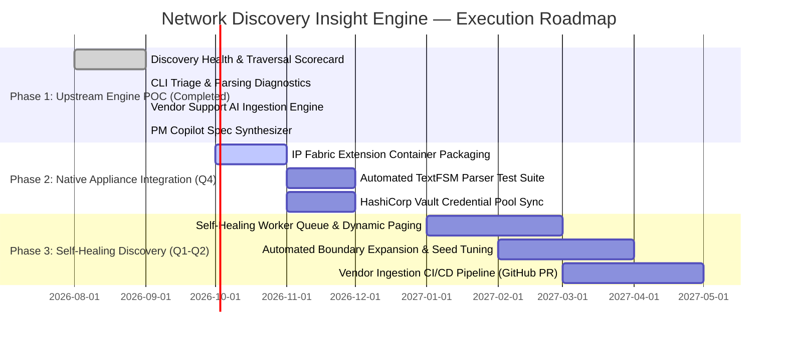

# 📄 Product Requirements Document (PRD)

# Network Discovery Insight Engine
### Upstream Collection, Normalization & Multi-Vendor Parser Diagnostics

| Metadata | Details |
|---|---|
| **Product Area** | Network Discovery & Upstream Platform Foundations |
| **Document Author** | **Ranaji Deb** (Senior Product Manager — Network Discovery) |
| **Target Platform** | IP Fabric v8.x / Discovery Worker Engine & Extension Ecosystem |
| **Status** | Working POC Completed ➔ Proposed Product Capability |
| **Classification** | Product Strategy, Technical Specification & Trade-off Memo |

---

## 1. Executive Summary & Problem Context

### 1.1 The Strategic Problem: Upstream Discovery vs. Downstream Analytics
In enterprise network assurance, **Network Discovery is the upstream collection, normalization, and modeling engine**. Downstream capabilities—such as snapshot drift detection, configuration compliance, and conversational network reasoning—are entirely dependent on the fidelity of this upstream foundation. If an edge switch's `show cdp neighbors` parser drops trailing commas, or if a jumphost security group drops SSH connections to a branch subnet, the downstream digital twin suffers silent topology blindspots.

Today’s enterprise customers and internal discovery engineering teams face three acute friction points:

1. **Discovery Fidelity & Normalization Blindspots:** Network teams lack immediate visibility into *normalization completeness*. While an inventory table might show 150 devices connected, Layer 2 STP graphs, Layer 3 routing tables, or Security ACL policies may only be 70% parsed due to unhandled firmware variations.
2. **Superficial Task Diagnostics & Triage Overload:** In discovery, failures are technical and nuanced: command timeouts on 140k-route VRF dumps, deprecated CLI syntax in minor OS patches (e.g., Check Point Gaia R81.20), truncated SSH buffer streams, and TACACS+ privilege mismatches. NetOps teams treat failed tasks as a simple count rather than diagnosing root causes.
3. **The Vendor Support Backlog Bottleneck:** Enterprise networks run a heterogeneous mix of Cisco, Juniper, Arista, Palo Alto, Fortinet, Check Point, and cloud overlays. Analyzing vendor release notes, extracting required CLI sequences, and writing production TextFSM/regex parsers for new firmware versions (e.g., Arista EOS 4.31, PAN-OS 11.1) takes weeks of manual engineering turnaround.

### 1.2 The Proposed Solution: Discovery Insight Engine
The **Discovery Insight Engine** transforms raw discovery logs, worker telemetry, and vendor documentation into an actionable product decision platform:
- **Discovery Health & Traversal Scorecard:** Quantifies Layer 2, Layer 3, and Security normalization completeness alongside seed IP reachability, unreached neighbor hops, and credential pool hit rates.
- **Discovery Triage & Parsing Diagnostics:** Replaces superficial task counts with CLI-level root-cause diagnostics (SSH timeouts vs. regex pattern breaks vs. jumphost drops).
- **Vendor Support & AI Ingestion Engine:** Matches unmanaged MAC OUIs and unparsed `sysDescr` strings against IP Fabric’s support matrix, using an LLM to digest vendor release notes and generate production CLI command sequences and regex capture patterns.
- **PM Copilot & Discovery Spec Synthesizer:** Demonstrates AI for internal product management velocity—synthesizing raw customer requests and vendor API docs into structured Jira epics with explicit engineering vs. business trade-offs.

---

## 2. Discovery Engine Architecture & Upstream Pipeline

```
┌────────────────────────────────────────────────────────────────────────────────────────┐
│                        IP FABRIC UPSTREAM DISCOVERY PIPELINE                          │
│                                                                                        │
│   [1. Seed IP Ingestion] ──► [2. Worker Queue & SSH/API] ──► [3. Command Execution]   │
│   • 24 Gateway Seeds         • 32 Async Worker Pool          • Version Detection       │
│   • Boundary Filters         • Jumphost Routing & Proxy      • Chunked CLI Pagination  │
│                                                                                        │
│                                           │                                            │
│                                           ▼                                            │
│   [4. Regex / TextFSM Parsing] ──► [5. Multi-Vendor Normalization] ──► [6. Digital Twin]│
│   • Named Group Capture            • L2 Switching & STP Graph           • Canonical L1-L4│
│   • Schema Extraction              • L3 Routing & VRF Tables            • Intent Graph   │
│   • Buffer Overflow Guard          • Security Policies & Zones          • Topology Model │
└────────────────────────────────────────────────────────────────────────────────────────┘
```

---

## 3. Target User Personas & Problem Scenarios

| Persona | Primary Goal | Current Pain Point | How Discovery Insight Engine Solves It |
|---|---|---|---|
| **Lead Discovery Engineer / Parser Architect** | Maintain & scale multi-vendor CLI regex parsers across 40+ OS versions | Spends days manually reading vendor release notes and reverse-engineering CLI syntax changes | AI Vendor Ingestion automatically generates CLI command lists, named regex groups, and unit tests |
| **Enterprise Network Discovery Lead** | Ensure 100% snapshot coverage and eliminate unmapped subnets | Cannot easily isolate why discovery failed (SSH timeout vs auth fail vs regex drop) | Tab 2 isolates exact failed commands, raw CLI snippets, and classifies root causes |
| **Product Manager (Network Discovery)** | Prioritize vendor roadmap, manage worker queue scalability, and evaluate trade-offs | Sift through noisy customer RFQs and balance core engine scaling vs edge hardware requests | PM Copilot synthesizes structured Jira Epics, technical specs, and trade-off memos |
| **VP of Network Infrastructure / CISO** | Ensure deterministic audit compliance and digital twin accuracy | Unsure if snapshot blindspots exist before signing off on change windows | Discovery Health Scorecard provides authoritative Layer 2/3/Sec normalization rate metrics |

---

## 4. Product Trade-off Memo & The "Anti-Roadmap"

> **Disciplined Product Judgment:** A core competency of the Senior PM for Network Discovery is owning what we build, what we defer, and what we deliberately choose *not* to do.

```
┌───────────────────────────────────────────────────────────────────────────────────────┐
│                           STRATEGIC ROADMAP TRADE-OFF MATRIX                          │
│                                                                                       │
│   HIGH VALUE, HIGH LEVERAGE (BUILD NOW - P0)   │ HIGH EFFORT, LOW LEVERAGE (DEFER)   │
│   • Deep CLI/API Normalization Engine          │ • Real-time Streaming Telemetry     │
│   • Distributed Worker Queue (50k Scalability) │ • Active Configuration Push / Remed │
│   • AI Vendor Release Note Ingestion           │ • Shallow SNMP Ping Sweeps          │
│   ─────────────────────────────────────────────┼─────────────────────────────────────│
│   NICHE / VOCAL SKEW (SAY NO / REJECT)         │ STRATEGIC ENABLERS (PHASE 2 - P1)   │
│   • Bespoke Parsers for Vintage End-of-Life HW │ • Automated Credential Vault Sync   │
│   • Proprietary Vendor Metric Bloat            │ • Seed Boundary Auto-Expansion      │
└───────────────────────────────────────────────────────────────────────────────────────┘
```

### 4.1 What We Deliberately Chose Not to Build (The Anti-Roadmap)

1. **We Do NOT Build Real-Time Streaming Telemetry or 5-Second SNMP Polling:**
   - *Rationale:* IP Fabric is a **deterministic network assurance and mathematical verification platform**, not an APM/telemetry monitoring tool like Datadog or Prometheus. Streaming telemetry generates gigabytes of noisy metric time-series data without topological context. IP Fabric’s core customer value is snapshot-based, stateful digital twin modeling (verifying end-to-end path lookups, STP root consistency, and ACL reachability).
   - *Strategic Decision:* We integrate with telemetry platforms via webhooks and API rather than rebuilding a time-series polling engine.

2. **We Do NOT Build Shallow Ping Sweeps / Nmap Discovery:**
   - *Rationale:* Port scanning and ping sweeps create phantom inventory without configuration grounding. They do not extract forwarding tables, VRF memberships, or security rules.
   - *Strategic Decision:* Discovery is strictly **authenticated, deep state extraction** via SSH/REST/API. If an IP does not authenticate, it is flagged as an unreached neighbor hop rather than an unverified inventory item.

3. **We Do NOT Build Active Configuration Push or Automated Remediation:**
   - *Rationale:* IP Fabric is the **independent, read-only source of truth**. If IP Fabric executes configuration changes, it loses its objective auditor status and introduces catastrophic blast-radius risks in enterprise core environments.
   - *Strategic Decision:* We push verified findings and structured diffs to ServiceNow, Ansible, Terraform, and NetBox via outbound webhooks.

### 4.2 Engineering vs. Business Trade-offs

#### Trade-off 1: Core Discovery Queue Scalability (50,000 Devices) vs. Bespoke Edge Hardware Requests
- **The Dilemma:** A single vocal enterprise customer requests custom parser support for 140 vintage Enterasys/Extreme EOS switches (firmware 6.81, end-of-life 2014) representing $80k ARR. Meanwhile, our top 20 enterprise customers (representing $12M ARR) are scaling to 50,000 devices and experiencing queue worker exhaustion and snapshot timeouts on large BGP route dumps.
- **The PM Decision:** **Prioritize Core Queue Scalability & Distributed Worker Refactoring (P0).**
- **The Framework:** Bespoke legacy parsers incur ongoing maintenance debt and bloat the test suite for diminishing customer value. By refactoring the discovery queue (chunked table streaming, per-worker memory caps, and async I/O multiplexing), we unlock 50k-node scalability for the entire customer base. For the legacy customer, we provide an SNMP Tier-3 basic inventory profile or offer a partner extension SDK.

#### Trade-off 2: Standardized Canonical Schemas vs. Proprietary Vendor State Bloat
- **The Dilemma:** Vendors frequently add proprietary telemetry fields (e.g., proprietary optical power metrics, proprietary chassis fan speeds).
- **The PM Decision:** **Enforce strict normalization into canonical IP Fabric graph models.**
- **The Framework:** IP Fabric’s digital twin value comes from vendor-agnostic graph modeling. Proprietary vendor metrics are stored in extensible metadata JSON payloads without polluting the core topology graph schema.

#### Trade-off 3: Deterministic Regex/TextFSM Core Parsers vs. Runtime Non-Deterministic LLM Parsing
- **The Dilemma:** Using an LLM to parse CLI outputs at runtime during a live snapshot discovery scan.
- **The PM Decision:** **Keep Core Runtime 100% Deterministic (TextFSM/Regex); Use AI at Development/Ingestion Time.**
- **The Framework:** Running an LLM against live SSH streams for 50,000 devices introduces prohibitive API latency, cost, and non-deterministic hallucination risks. Instead, we use AI *offline* in the PM/Engineering workflow to generate verified, deterministic regex parsers and unit tests.

### 4.3 Vendor Support Prioritization Framework (Weighted Decision Matrix)

When deciding which vendor firmware or platform to support next, the Discovery PM applies the following scoring model:

$$\text{Priority Score} = 0.40 \cdot \text{TAM} + 0.30 \cdot \text{GraphImpact} + 0.20 \cdot \text{Stability} + 0.10 \cdot \text{CustomerVotes}$$

| Factor | Weight | Evaluation Criteria |
|---|---|---|
| **Enterprise TAM & Market Share** | **40%** | Prevalence in Global 2000 target accounts (e.g., Arista EVPN, Cisco NX-OS, Palo Alto, AWS/Azure TGW) |
| **Topology Graph Impact** | **30%** | Does the device participate in Core Layer 2/3 routing and security policy (Spine/Leaf/Firewall) vs. dumb edge leaf? |
| **API/CLI Determinism & Stability** | **20%** | Does the vendor provide stable CLI/REST APIs with predictable pagination, or erratic legacy syntax? |
| **Customer Concentration** | **10%** | Number of active enterprise customer requests across Salesforce / Jira backlog |

---

## 5. Functional Requirements (P0 / P1 / P2)

### 5.1 Discovery Health & Seed Traversal Scorecard (Tab 1)

| Priority | Feature ID | Requirement Description | Acceptance Criteria |
|---|---|---|---|
| **P0** | `FR-DH-01` | **Multi-Tier Normalization Tracking** | Calculate and render real-time normalization completeness for Layer 2 (STP/VLAN), Layer 3 (Routing/VRF/ARP), and Security Policy tables. |
| **P0** | `FR-DH-02` | **Seed Reachability & Hop Distribution** | Render discovery traversal expansion funnel from Seed IPs (Hop 0) through direct neighbors (Hop 1) to edge access (Hop 3+). |
| **P0** | `FR-DH-03` | **Credential Pool Hit Rate Analysis** | Visualize authentication profile success rates and identify failed authentication clusters. |
| **P0** | `FR-DH-04` | **Worker Queue & Scalability Telemetry** | Display snapshot duration, worker pool utilization (%), average discovery latency per device, and total CLI megabytes parsed. |
| **P0** | `FR-DH-05` | **AI Discovery Health Synthesis** | Generate structured product assessment highlighting top normalization blockers, queue status, and immediate operational actions. |
| **P1** | `FR-DH-06` | **Normalization Device Explorer** | Interactive table with visual progress bars for L2/L3/Sec completion, seed hop tags, and credential profile filters. |

---

### 5.2 Discovery Triage & Parsing Diagnostics (Tab 2)

| Priority | Feature ID | Requirement Description | Acceptance Criteria |
|---|---|---|---|
| **P0** | `FR-DT-01` | **CLI-Level Failure Diagnostic Inspector** | Ingest and render failed CLI commands, execution phase, raw CLI buffer snippets, and technical root causes. |
| **P0** | `FR-DT-02` | **Failure Category Classification** | Categorize failures into: `Command Timeout`, `Parsing/Regex Mismatch`, `SSH Jumphost Timeout`, `Unsupported CLI Syntax`, and `Auth / Privilege Mismatch`. |
| **P0** | `FR-DT-03` | **AI Root Cause & Regex Fix Synthesis** | LLM analyzes failure clusters and generates proposed regex patches, command pagination flags, and discovery timeout adjustments. |
| **P0** | `FR-DT-04` | **Unreached Neighbor Traversal Tracker** | Surface CDP/LLDP neighbors detected on active devices where discovery stopped due to authentication failure or boundary rules. |
| **P1** | `FR-DT-05` | **Unmapped Subnet Detector** | Highlight subnets referenced in routing tables that have zero discovered devices. |

---

### 5.3 Vendor Support Prioritization & AI Ingestion Engine (Tab 3)

| Priority | Feature ID | Requirement Description | Acceptance Criteria |
|---|---|---|---|
| **P0** | `FR-VS-01` | **Unmanaged OUI & sysDescr Gap Analyzer** | Match unknown MAC OUIs and unparsed `sysDescr` strings collected during discovery against IP Fabric's supported matrix. |
| **P0** | `FR-VS-02` | **AI Vendor Release Note Ingestion** | Ingest raw vendor documentation, command references, or CLI snippets and automatically extract required CLI discovery commands. |
| **P0** | `FR-VS-03` | **Automated Regex Pattern Generation** | Generate production-ready Python regular expressions with named capture groups `(?P<group_name>...)` mapped to canonical IP Fabric schema tables. |
| **P1** | `FR-VS-04` | **Parser Unit Test Generator** | Generate mock JSON test fixtures containing raw CLI sample inputs and expected parsed dictionary outputs. |
| **P1** | `FR-VS-05` | **Firmware Gap Prioritization Backlog** | Maintain backlog of requested firmware targets scored by customer votes, complexity, and priority. |

---

### 5.4 PM Copilot & Technical Discovery Spec Synthesizer (Tab 4)

| Priority | Feature ID | Requirement Description | Acceptance Criteria |
|---|---|---|---|
| **P0** | `FR-PM-01` | **Messy Customer Input Ingestion** | Accept raw customer feature requests, enterprise RFQs, or vendor API snippets. |
| **P0** | `FR-PM-02` | **Jira Epic Synthesis** | Synthesize structured Jira Epics including Problem Statement, Customer Segment, Discovery Scope, and Gherkin Acceptance Criteria. |
| **P0** | `FR-PM-03` | **Explicit Trade-off Generation** | Automatically define in-scope vs. out-of-scope boundaries and scalability impacts for 50,000-device enterprise networks. |
| **P1** | `FR-PM-04` | **Downloadable Spec Markdown** | Export synthesized Jira Epics and trade-off memos as standard Markdown files. |

---

### 5.5 Discovery Engine Assistant (Tab 5)

| Priority | Feature ID | Requirement Description | Acceptance Criteria |
|---|---|---|---|
| **P0** | `FR-DA-01` | **Multi-Turn Discovery Reasoning** | Conversational chat interface grounded in discovery telemetry, CLI logs, and regex parser architectures. |
| **P0** | `FR-DA-02` | **Context-Grounded Answers** | Responses cite specific hostnames, CLI failure commands, hop counts, and regex patterns. |

---

## 6. Phased Evolution Roadmap



---

## 7. Success Metrics & Product KPIs

| Metric Category | Target KPI | Measurement Baseline | Target Outcome |
|---|---|---|---|
| **Discovery Fidelity** | Snapshot Normalization Completion | Currently ~85–90% on initial scan | **≥ 98.5%** via proactive CLI & traversal diagnostics |
| **Triage Velocity** | Time to Diagnose Failed Discovery Tasks | 45–60 mins of manual log inspection | **< 3 minutes** via AI Root Cause Classifier |
| **Vendor Support Velocity** | New Firmware Parser Turnaround Time | 3–4 weeks per vendor release | **< 3 days** using AI Vendor Ingestion & Regex Synthesizer |
| **Scalability & Reliability** | Worker Queue Saturation at 50k Nodes | Queue exhaustion on large VRF dumps | **Zero dropped SSH sessions** via chunked table pagination |
| **Product Team Leverage** | Spec Synthesis Time for New Vendor Specs | 6–8 hours per technical spec | **< 15 minutes** via PM Copilot |

---

## 8. Conclusion & PM Philosophy

This product specification and working prototype demonstrate three principles:
1. **Focus on the Engine First:** Network Discovery is where trust in IP Fabric is established. Deep Layer 2/3/Sec normalization and robust CLI parsing matter more than superficial UI overlays.
2. **Use AI for Tangible Leverage:** We use AI where it provides high ROI—accelerating vendor release note digestion, automating regex generation, and synthesizing technical specs—while keeping core runtime discovery 100% deterministic and mathematically sound.
3. **Ruthless Roadmap Prioritization:** Product excellence is defined by the clarity of our trade-offs. We choose 50,000-device worker scalability and deep multi-vendor normalization over fragmented legacy requests and noisy polling features.

---
*Authored by **Ranaji Deb** — Candidate for Senior Product Manager, Network Discovery at IP Fabric.*

